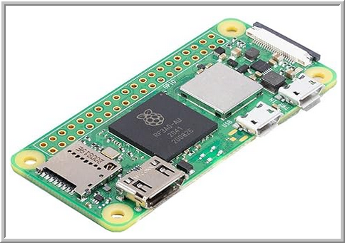

# Raspberry Pi Security Camera

- [Raspberry Pi Security Camera](#raspberry-pi-security-camera)
- [Materials](#materials)
  - [Final Project](#final-project)
  - [Other Options Considered](#other-options-considered)
- [Requirements](#requirements)
- [References](#references)
  - [Software](#software)
  - [Articles](#articles)
- [Journal](#journal)
- [SpyPi Setup](#spypi-setup)
  - [Once after burn](#once-after-burn)
  - [Thereafter](#thereafter)


IDL project for Robby



# Materials

## Final Project

* [Vilros Raspberry Pi Zero 2 W Basic Starter Kit with Aluminum Alloy Multi-Purpose Case -Incudes Pi Zero 2 W Board, Multi Use Case, Power Supply, HDMI-USB Adapters and More](https://www.amazon.com/dp/B0CLPHV6S4)
* [SanDisk 32GB (Pack of 2) Ultra microSDHC UHS-I Memory Card (2x32GB) with Adapter - SDSQUA4-032G-GN6MT](https://www.amazon.com/dp/B08J4HJ98L) ($9)
* [InnoMaker Raspberry Pi Camera Module 5MP 1080P OV5647 Sensor with M12 FOV90 IR Filter LEN for Raspberry Pi 4, Pi 3 B+, Pi 3, Pi 2, Pi B+, Pi A, Pi Zero](https://www.amazon.com/gp/product/B07G9VLPZH) ($11)

## Other Options Considered
* [Raspberry Pi Zero 2 W (Wireless / Bluetooth) 2021 (RPi Zero 2W)](https://www.amazon.com/Raspberry-Zero-Bluetooth-RPi-2W/dp/B09LH5SBPS) ($30) - the board by itself.
* https://www.amazon.com/Arducam-Raspberry-Camera-IMX519-Module/dp/B0C53BBMLG ($40)
* [Arducam for Raspberry Pi Zero Camera Module, 5MP 1080P on Raspbian, MotionEye, Octopi and More (Cables in 2 Kinds) ](https://www.amazon.com/dp/B01LY05LOE) - Shipped broken. Had to return it.
* [Arducam for Raspberry Pi Camera 16MP IMX519 Camera Module with 140°(D) Wide Angle M12 Lens for Raspberry Pi and OpenHD](https://www.amazon.com/Arducam-Raspberry-Camera-IMX519-Module/dp/B0C53BBMLG)
* [Vilros Raspberry Pi Zero 2 W Basic Starter Kit with Muti Purpose ABS Case -Incudes Pi Zero 2 W Board, Multi Use Case, Power Supply, HDMI-USB Adapters and More (Black)](https://www.amazon.com/Vilros-Raspberry-Incudes-HDMI-USB-Adapters/dp/B09M1PS35R) - contains camera module adapter

# Requirements

* Use Python 3
* Needs outlet for power
* Camera has wide angle
* Write Python code that:
  * Looks for changes in the picture
  * When changes are detected:
    * Takes a picture every second
    * Saves that picture to a local computer in the house on the network
    * Stops when no changes are detected


# SpyPi Setup

* Burn the micro sdcard (32GB) to enable SSH and hit the wifi router
* Use `pi : pi` as the username
* Start command terminal
* `ssh pi@192.168.1.XX`

## Once after burn
```
```

## Thereafter


# References

## Software
* [Getting Started with Raspberry Pi Zero W and Python 3](https://www.hackster.io/sameerk/getting-started-with-raspberry-pi-zero-w-and-python-3-16c274)
* [How To Use The Raspberry Pi Camera With Python In 2023](https://raspberrytips.com/picamera2-raspberry-pi/)
* [WiFi Security Camera With a Pi Zero 2W](https://www.instructables.com/WiFi-Security-Camera-With-a-Pi-Zero-2W/)
* [Raspberry Pi Zero W and Pi Camera Application](https://www.cytron.io/tutorial/raspberry-pi-zero-w-pi-camera-application)
* [Build a Raspberry Pi Security Camera Network](https://pimylifeup.com/raspberry-pi-security-camera/)
* [How to build a Raspberry Pi Security Camera - A Comprehensive Step-By-Step Guide](https://fleetstack.io/blog/how-to-build-raspberry-pi-security-camera-comprehensive-guide)
* [DIY Security Camera: How to Turn Your Raspberry Pi into a Surveillance System](https://codegather.dev/posts/raspberry-pi-surveillance-system/)
* [How to build a Raspberry Pi security camera](https://www.techradar.com/how-to/computing/how-to-build-a-raspberry-pi-security-camera-1321441)
* [How to Build a Motion-Triggered Raspberry Pi Security Camera](https://www.tomshardware.com/how-to/raspberry-pi-security-camera)
* [How to Create a Raspberry Pi Security Camera with Motion Alerts](https://www.tomshardware.com/how-to/raspberry-pi-security-camera-motion-sensor)

## Articles
* [Getting started with the Camera Module](https://projects.raspberrypi.org/en/projects/getting-started-with-picamera/7)

# Journal

* 2024-01-16 - Pizero kit arrives
* 2024-01-17 - Camera arrives
* 2024-01-18 - SD cards arrive
  * Download OS image [Raspberry Pi OS Lite](https://www.raspberrypi.com/software/operating-systems/#raspberry-pi-os-64-bit), which is a headless version.
  * Burned the image onto the Pi with [rpi-imager](https://learn.adafruit.com/raspberry-pi-zero-creation/using-rpi-imager), which allowed you to configure the WiFi and SSH before burning it so that when you turn on the Pi, it connects to the network and you can hit it with [Putty](https://en.wikipedia.org/wiki/PuTTY) immediately. Thus, you don't need to hook up a USB keyboard and HDMI monitor to start working with it. Python 3.9 comes installed on the distro.
```
sudo apt-get update
```
  * Could not get the OS to recognize the camera. Tried many different variations. Web research. After hours, determined that either the Pizero is broken or the camera is defective. Assumed camera. Bought a new camera.
* 2024-01-20 - Camera arrives
  * Put camera. Now detected. Returned the other camera to Amazon just to make a point and cast my vote. Mom said when she was at Benchmark Electronics, she had to buy 10 IoT devices just to get 2 that worked.
* 2024-01-21 - `pip install python3-opencv` is breaking the pi; running out of memory.
  * `sudo apt install python3-opencv` to install the binary - better approach.
  * `python3 -c 'import cv2; print(cv2.__version__)'` --> 4.5.1
  *


